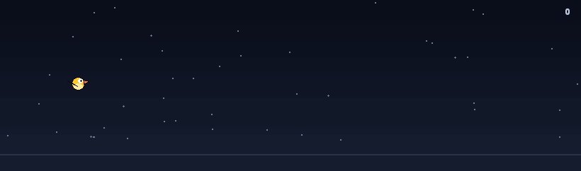

# gh-flappy-graph

Turn your GitHub contribution graph into a Flappy Bird animation.

Each week of contributions becomes a pipe. Busier weeks mean tighter gaps. The bird auto-flies through your entire year of coding.



## Usage

### GitHub Action

Update your game GIF daily. Add `.github/workflows/update-game.yml` to your profile repo:

```yaml
name: Update Flappy Graph

on:
  schedule:
    - cron: '0 0 * * *'
  workflow_dispatch:

permissions:
  contents: write

jobs:
  update-game:
    runs-on: ubuntu-latest
    steps:
      - uses: actions/checkout@v6
        with:
          fetch-depth: 2  # needed for the amend-based bloat prevention
      - uses: janmaaarc/gh-flappy-graph@v1
        with:
          github-token: ${{ secrets.GITHUB_TOKEN }}
          output-path: 'gh-flappy-graph.gif'
```

Then display it in your README:

```markdown

```

**Action inputs:**

| Input | Required | Default | Description |
|---|---|---|---|
| `github-token` | yes | | Token for fetching contributions (usually `secrets.GITHUB_TOKEN`) |
| `username` | no | repo owner | Username to generate the game for |
| `output-path` | no | `gh-flappy-graph.gif` | Where to save the GIF |
| `fps` | no | `30` | Animation frame rate |
| `bird` | no | `classic` | Bird theme: `classic`, `red`, `blue`, `ghost` |
| `commit-message` | no | `Update flappy graph GIF` | Commit message |

The action amends the previous update commit (instead of stacking a multi-MB commit per day) whenever the last commit message matches `commit-message`.

### CLI

```bash
pip install gh-flappy-graph

export GH_TOKEN=your_token   # needs read:user scope
gh-flappy-graph <username>

# options
gh-flappy-graph torvalds -o game.gif --fps 30 --max-frame 200
gh-flappy-graph torvalds --bird red
```

## How it works

1. Fetches your contribution calendar via the GitHub GraphQL API.
2. Each week becomes a pipe. Gap height scales inversely with that week's total contributions, colored with GitHub's contribution-green shades.
3. A bird eases through every gap on autopilot and the whole run is saved as a looping GIF.

Pipe placement is deterministic per profile, so the animation only changes when your contributions do.

## Development

```bash
git clone https://github.com/janmaaarc/gh-flappy-graph.git
cd gh-flappy-graph
uv sync
uv run pytest
```

## License

MIT
